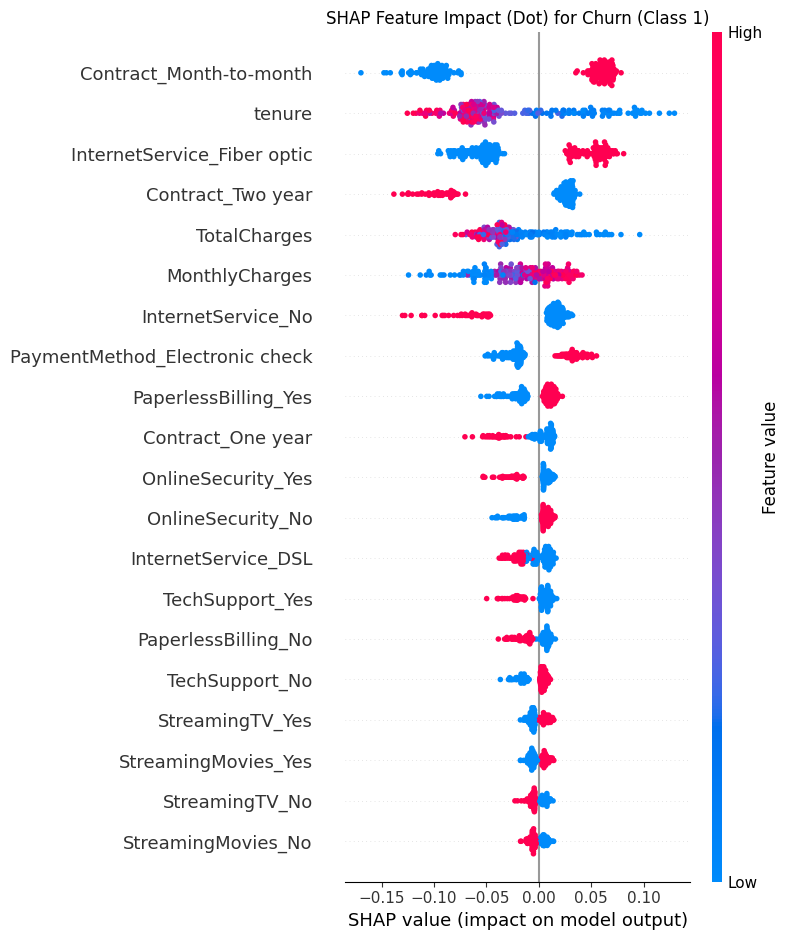
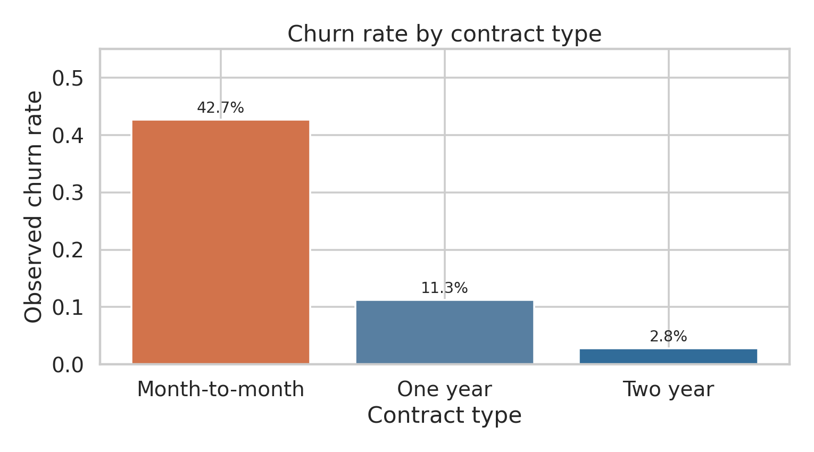

# Customer churn prediction | Applied Machine Learning project

A group project that compares classical classifiers, a feedforward neural network, and an autoencoder for predicting customer churn in the IBM Telco sample data. This portfolio edition fixes a comparison-table error in the submitted notebook and highlights the detailed SHAP dot plots.

**Group members:** Md Abdul Wahid Raju, Sazzad Hossain, Shusmita Dutta, Asma Akter. This repository presents shared coursework; it does not claim individual authorship of every section. The provided materials do not establish each person's complete coding contribution.

## Results from the submitted notebook

| Model | Test accuracy | Churn F1 |
| --- | ---: | ---: |
| Soft voting (logistic regression + random forest + gradient boosting) | 0.7807 | **0.6264** |
| Tuned random forest | 0.7701 | 0.6241 |
| Tuned logistic regression | 0.7395 | 0.6125 |
| Feedforward neural network | 0.7913 | 0.6111 |
| Tuned gradient boosting | 0.8027 | 0.5813 |
| Autoencoder (8 features) + logistic regression | 0.6828 | 0.5377 |

The ensemble achieved 259 true positives, 194 false positives, 115 false negatives, and 841 true negatives on the 1,409-row test set. Its F1 advantage over the forest was **0.0022**; this small difference does not establish that it would perform better on new data. These are the saved results from the submitted run, not independently rerun benchmarks. Neural-network reruns may differ without fixed framework seeds.

## Detailed SHAP plots

[Full-size random forest SHAP beeswarm](figures/random_forest_shap_beeswarm.png) · [Neural network SHAP beeswarm](figures/neural_network_shap_beeswarm.png)

These figures are exported directly from the submitted notebook's **dot plots**, rather than its bar plots. The forest plot explains churn-class output for a 200-row test subset; the neural-network plot uses a 200-row test subset and standardized features. SHAP describes the trained models' predictions, **not causal effects**. One-hot indicators should be interpreted as encoded levels of their original features.

## Exploratory and error analysis

[Class balance](figures/churn_distribution.png) · [Ensemble confusion matrix](figures/voting_confusion_matrix.png)

The file contains 7,043 rows and 21 columns: 19 predictors, an ID, and the target. The 11 blank `TotalCharges` entries belong to zero-tenure customers and were set to zero in the group analysis. About 26.5% of customers churned. The predictors describe association, and the sample is a fictional telco rather than deployment evidence.

## Reproduce the coursework

1. Get the source dataset as described in [data/README.md](data/README.md).
2. From the repository root, create a Python environment and run `pip install -r requirements.txt`.
3. Open `notebooks/customer_churn_analysis.ipynb` and run cells in order from the repository root. The notebook trains multiple tuned models and neural networks; it may take some time.

The notebook is an adapted coursework record. Its original cached outputs have been cleared and it has **not** been fully rerun in this package. See [review and corrected report](docs/REVIEW.md) for the evidence, discrepancies, and limitations.

## Files

- `notebooks/`: coursework notebook with corrected data path and comparison table.
- `figures/`: authentic detailed SHAP plots and clearly identified summary figures.
- `docs/REVIEW.md`: corrected written results and careful review of the original report.
- `docs/original_group_report.pdf` and `docs/group_presentation.pdf`: original group submissions retained for provenance; their neural-network comparison numbers require the correction documented above.
- `data/README.md`: source and setup instructions; raw data are excluded.

**Dataset credit:** IBM Telco Customer Churn sample, accessed via [Kaggle's dataset listing](https://www.kaggle.com/datasets/blastchar/telco-customer-churn). This is a coursework portfolio, not a deployed churn decision system.
